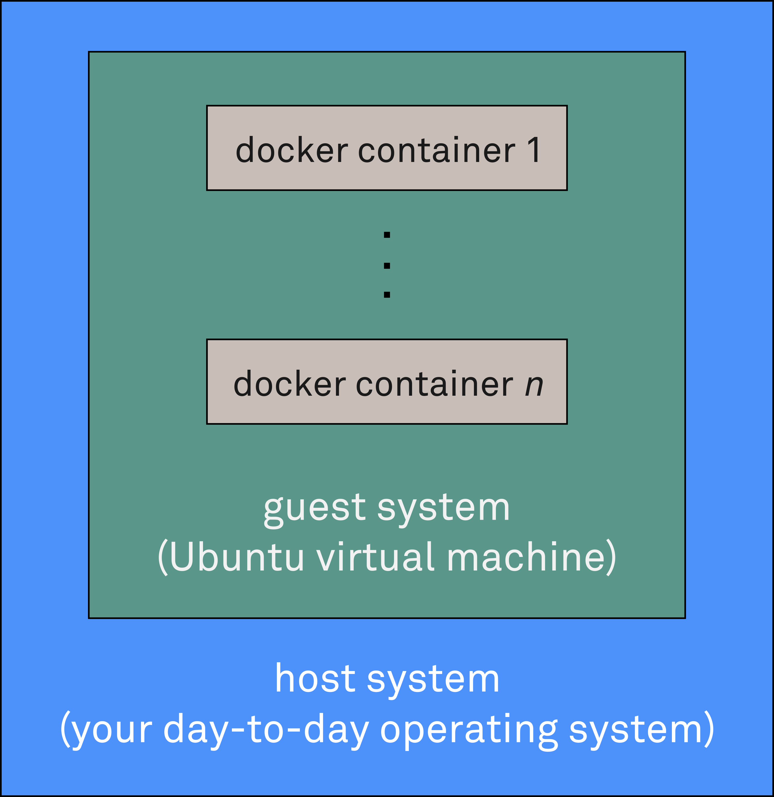

Note we have GoogleAnalytics enabled for this tutorial to help show our funders that the work
we do is useful to others.

|
|
|

Getting started
---------------

On your system, start VirtualBox.

This tutorial uses a virtual machine to help avoid issues that are due to system configuration.
In case you don't have a copy of the virtual machine, you can
download it from GoogleDrive `here`__ (5.5 Gb). After the download finishes, click ``File`` in VirtualBox, then
``Import appliance``, then select the file you downloaded.

__ https://drive.google.com/open?id=0B1GaxSkd5lU8UkF6V1A1VGpPZ2c

During the import, you'll see an initialization wizard. Make sure that the virtual machine is configured with two CPUs.

Start the virtual machine and log in as user ``travis`` with password ``password``.

Once the system has booted, Click ``Activities`` and then start both a terminal and Firefox by clicking their respective
icons. Use Firefox to navigate to the tutorial text at `<https://xenon-tutorial.readthedocs.io>`_.

In the terminal, confirm that the ``xenon`` command line interface
program can be found on the system:

.. code-block:: bash

   xenon --help

.. code-block:: bash

   xenon --version
   Xenon CLI v3.0.1, Xenon library v3.0.1, Xenon cloud library v3.0.1

|
|
|

Interacting with filesystems
----------------------------

Essentially, ``xenon`` can be used to manipulate files and to interact with schedulers, where either one can be local
or remote. Let's start simple and see if we can do something with local files. First, check its help:

.. code-block:: bash

      xenon filesystem --help

The usage line suggests we need to pick one from ``{file,ftp,s3,sftp,webdav}``.
Again, choose what seems to be the simplest option (``file``), and again, check its help.

.. code-block:: bash

      xenon filesystem file --help

``xenon filesystem file``'s usage line seems to suggest that I need to pick one
from ``{copy,list,mkdir,remove,rename}``. Simplest one is probably ``list``, so:

.. code-block:: bash

      xenon filesystem file list --help

So we need a ``path`` as final argument.

In case you hadn't noticed the pattern, stringing together any number of ``xenon`` subcommands and appending ``--help``
to it will get you help on the particular combination of subcommands you supplied.

The focus of this tutorial is on using Xenon's command line interface, but be
aware that you can use xenon's functionality from other programming
languages through `xenon's  gRPC extension`__.

Where relevant, we have included equivalent code snippets,
written in Java and Python, as a separate tab.

__ https://github.com/xenon-middleware/xenon-grpc

Let's try listing the contents of ``/home/travis/fixtures/``.

.. tabs::

   .. group-tab:: Bash

      .. literalinclude:: code-tabs/bash/DirectoryListing.sh
         :language: bash

   .. group-tab:: Java

      .. literalinclude:: code-tabs/java/src/main/java/nl/esciencecenter/xenon/tutorial/DirectoryListing.java
         :language: java
         :linenos:

   .. group-tab:: Python

      .. literalinclude:: code-tabs/python/pyxenon_snippets/directory_listing.py
         :language: python
         :linenos:

The result should be more or less the same as that of ``ls -1``.

``xenon filesystem file list`` has a few options that let you specify the details of the list operation, e.g.
``--hidden``

.. tabs::

   .. group-tab:: Bash

      .. literalinclude:: code-tabs/bash/DirectoryListingShowHidden.sh
         :language: bash

   .. group-tab:: Java

      .. literalinclude:: code-tabs/java/src/main/java/nl/esciencecenter/xenon/tutorial/DirectoryListingShowHidden.java
         :language: java
         :linenos:

   .. group-tab:: Python

      .. literalinclude:: code-tabs/python/pyxenon_snippets/directory_listing_show_hidden.py
         :language: python
         :linenos:

and ``--recursive``

.. tabs::

   .. group-tab:: Bash

      .. literalinclude:: code-tabs/bash/DirectoryListingRecursive.sh
         :language: bash

   .. group-tab:: Java

      .. literalinclude:: code-tabs/java/src/main/java/nl/esciencecenter/xenon/tutorial/DirectoryListingRecursive.java
         :language: java
         :linenos:

   .. group-tab:: Python

      .. literalinclude:: code-tabs/python/pyxenon_snippets/directory_listing_recursive.py
         :language: python
         :linenos:

Now let's create a file and try to use ``xenon`` to copy it:

.. code-block:: bash

      cd /home/travis
      echo 'some content' > thefile.txt

Check the relevant help

.. code-block:: bash

      xenon filesystem file --help
      xenon filesystem file copy --help

So, the ``copy`` subcommand takes a source path and a target path:

.. tabs::

   .. group-tab:: Bash

      .. literalinclude:: code-tabs/bash/CopyFileLocalToLocalAbsolutePaths.sh
         :language: bash

   .. group-tab:: Java

      .. literalinclude:: code-tabs/java/src/main/java/nl/esciencecenter/xenon/tutorial/CopyFileLocalToLocalAbsolutePaths.java
         :language: java
         :linenos:

   .. group-tab:: Python

      .. literalinclude:: code-tabs/python/pyxenon_snippets/copy_file_local_to_local_absolute_paths.py
         :language: python
         :linenos:

Note that the source path may be standard input, and that the target path may be standard output:

.. code-block:: bash

      # read from stdin:
      cat thefile.txt | xenon filesystem file copy - mystdin.txt

      # write to stdout:
      xenon filesystem file copy thefile.txt - 1> mystdout.txt

``xenon filesystem file`` has a few more subcommands, namely ``mkdir``, ``rename`` and ``remove``. You can
experiment a bit more with those or move on to the next section.

|
|
|

Interacting with schedulers
---------------------------

Now let's see if we can use schedulers, starting with `SLURM`__. For this part, we need access to a machine that is running
SLURM. To avoid problems related to network connectivity, we won't try to connect to a physically remote SLURM machine,
but instead, we'll use a dockerized SLURM installation. This way, we can mimic whatever infrastructure we need. The
setup will thus be something like this:

__ https://slurm.schedmd.com/

|
|

A copy of the SLURM Docker image (`xenonmiddleware/slurm`__:17) has been included in the virtual machine. Bring it
up with:

__ https://hub.docker.com/r/xenonmiddleware/slurm/

.. code-block:: bash

      docker run --detach --publish 10022:22 --hostname slurm17 xenonmiddleware/slurm:17

Use ``docker ps`` to check the state of the container

.. code-block:: bash

      docker ps

Once the status is ``healthy``, see if we can ``ssh`` into it on port ``10022`` as user ``xenon`` with password

``javagat``:

.. code-block:: bash

      ssh -p 10022 xenon@localhost

      # if that works, exit again
      exit

Check the help to see how the ``slurm`` subcommand works:

.. code-block:: bash

      xenon scheduler slurm --help

Let's first ask what queues the SLURM scheduler has. For this, we need to specify
a location, otherwise ``xenon`` does not know who to ask for the list of queues. According to the help,
``LOCATION`` is any location format supported by ``ssh`` or ``local`` scheduler.
Our dockerized SLURM machine is reachable as ``ssh://localhost:10022``.
We'll also need to provide a ``--username`` and ``--password``
for that location, as follows:

.. tabs::

   .. group-tab:: Bash

      .. literalinclude:: code-tabs/bash/SlurmQueuesGetter.sh
         :language: bash

   .. group-tab:: Java

      .. literalinclude:: code-tabs/java/src/main/java/nl/esciencecenter/xenon/tutorial/SlurmQueuesGetter.java
         :language: java
         :linenos:

   .. group-tab:: Python

      .. literalinclude:: code-tabs/python/pyxenon_snippets/slurm_queues_getter.py
         :language: python
         :linenos:

In case you are reluctant to type plaintext passwords on the command line, for example because of logging in
``~/.bash_history``, know that you can supply passwords from a file, as follows:

.. code-block:: bash

      xenon scheduler slurm --location ssh://localhost:10022 --username xenon --password @password.txt queues

in which the file ``password.txt`` should contain the password. Since everything about the user ``xenon`` is public
knowledge anyway, such security precautions are not needed for this tutorial, so we'll just continue to use the
``--password PASSWORD`` syntax.

Besides ``queues``, other ``slurm`` subcommands are ``exec``, ``submit``, ``list``, ``remove``, and ``wait``. Let's try
to have ``xenon`` ask SLURM for its list of jobs in each queue, as follows:

.. code-block:: bash

      xenon scheduler slurm --location ssh://localhost:10022 --username xenon --password javagat list
      # should work, but we don't have any jobs yet

Now, let's try to submit a job using ``slurm submit``. Its usage string suggests that we need to provide (the path
of) an ``executable``. Note that the executable should be present inside the container when SLURM starts its execution.
For the moment, we'll use ``/bin/hostname`` as the executable. It simply prints the name of the host on the command line.
For our docker container, it should return the hostname ``slurm17`` of the Docker
container, or whatever hostname you specified for it when you ran the ``docker run`` command earlier:

.. code-block:: bash

      # check the slurm submit help for correct syntax
      xenon scheduler slurm submit --help

      # let xenon submit a job with /bin/hostname as executable
      xenon scheduler slurm --location ssh://localhost:10022 --username xenon --password javagat \
      submit /bin/hostname

      # add --stdout to the submit job to capture its standard out so we know it worked:
      xenon scheduler slurm --location ssh://localhost:10022 --username xenon --password javagat \
      submit --stdout hostname.stdout.txt /bin/hostname

      # check to see if the output was written to file /home/xenon/hostname.stdout.txt
      ssh -p 10022 xenon@localhost ls -l
      # see what's in it
      ssh -p 10022 xenon@localhost cat hostname.stdout.txt

Below are a few more examples of ``slurm submit``:

.. code-block:: bash

      # executables that take options prefixed with '-' need special syntax, e.g. 'ls -la'
      xenon scheduler slurm --location ssh://localhost:10022 --username xenon --password javagat \
      submit --stdout /home/xenon/ls.stdout.txt ls -- -la

      # check to see if the output was written to file /home/xenon/ls.stdout.txt
      ssh -p 10022 xenon@localhost ls -l
      # see what's in it
      ssh -p 10022 xenon@localhost cat ls.stdout.txt

      # submit an 'env' job with environment variable MYKEY, and capture standard out so we know it worked
      xenon scheduler slurm --location ssh://localhost:10022 --username xenon --password javagat \
      submit --stdout /home/xenon/env.stdout.txt --env MYKEY=myvalue /usr/bin/env

      # check to see if the output from 'env' was written to file /home/xenon/env.stdout.txt
      ssh -p 10022 xenon@localhost ls -l
      # see what's in it
      ssh -p 10022 xenon@localhost cat env.stdout.txt

|
|
|

Combining filesystems and schedulers
------------------------------------

So far, we've used ``xenon`` to manipulate files on the local filesystem, and to run system executables on the remote
machine. In typical usage, however, you would use ``xenon`` to run executables or scripts of your own, which means that
we need to upload such files from the local system to the remote system.

A typical workflow may thus look like this:

   1. upload input file(s)
   2. submit job
   3. download generated output file(s)

Use an editor to create a file ``sleep.sh`` with the following contents (the virtual machine comes with a bunch of editors
like ``gedit``, ``leafpad``, and ``nano``, but you can install a different editor from the repositories if you like):

.. literalinclude:: code-tabs/bash/sleep.sh
   :language: bash

You can test if your file is correct by:

.. code-block:: bash

      # last argument is the sleep duration in seconds
      bash sleep.sh 5

We need to upload ``sleep.sh`` to the remote machine. We can't use ``xenon filesystem file`` like we did before,
because we're copying between file systems, so let's look at what other options are available:

.. code-block:: bash

      xenon filesystem --help

      # let's try sftp protocol
      xenon filesystem sftp --help

      # we're interested in 'upload' for now
      xenon filesystem sftp upload --help

We'll also need to tell ``xenon`` what location we want to connect to, and what credentials to use. The SLURM Docker
container we used before is accessible via SFTP using the same location, username and password as before, so let's use
that:

.. tabs::

   .. group-tab:: Bash
    
      .. literalinclude:: code-tabs/bash/UploadFileLocalToSftpAbsolutePaths.sh
         :language: bash

   .. group-tab:: Java

      .. literalinclude:: code-tabs/java/src/main/java/nl/esciencecenter/xenon/tutorial/UploadFileLocalToSftpAbsolutePaths.java
         :language: java
         :linenos:

   .. group-tab:: Python

      .. literalinclude:: code-tabs/python/pyxenon_snippets/upload_file_local_to_sftp_absolute_paths.py
         :language: python
         :linenos:

Now that the script is in place, we can submit a ``bash`` job using ``xenon scheduler slurm submit`` like before, taking
the newly uploaded ``sleep.sh`` file as input to ``bash``, and using a sleep duration of 60 seconds:

.. code-block:: bash

      # step 2: submit job
      xenon scheduler slurm --location ssh://localhost:10022 --username xenon --password javagat \
      submit --stdout sleep.stdout.txt bash sleep.sh 60

      # (should return an identifier for the job)

With the job running, let's see if it shows up in any of the SLURM queues:

.. tabs::

   .. group-tab:: Bash

      .. literalinclude:: code-tabs/bash/SlurmJobListGetter.sh
         :language: bash

   .. group-tab:: Java

      .. literalinclude:: code-tabs/java/src/main/java/nl/esciencecenter/xenon/tutorial/SlurmJobListGetter.java
         :language: java
         :linenos:

   .. group-tab:: Python

      .. literalinclude:: code-tabs/python/pyxenon_snippets/slurm_job_list_getter.py
         :language: python
         :linenos:

When we submitted, we did not specify any queues, so the default queue ``mypartition`` was used:

.. code-block:: bash

      xenon scheduler slurm --location ssh://localhost:10022 --username xenon --password javagat list --queue mypartition
      # should have the job identifier in it that was printed on the command line

      xenon scheduler slurm --location ssh://localhost:10022 --username xenon --password javagat list --queue otherpartition
      # this queue is empty

With step 1 (upload) and step 2 (submit) covered, step 3 (download) remains:

.. tabs::

   .. group-tab:: Bash

      .. literalinclude:: code-tabs/bash/DownloadFileSftpToLocalAbsolutePaths.sh
         :language: bash

   .. group-tab:: Java

      .. literalinclude:: code-tabs/java/src/main/java/nl/esciencecenter/xenon/tutorial/DownloadFileSftpToLocalAbsolutePaths.java
         :language: java
         :linenos:   

   .. group-tab:: Python

      .. literalinclude:: code-tabs/python/pyxenon_snippets/download_file_sftp_to_local_absolute_paths.py
         :language: python
         :linenos:

By this time you may start to consider putting those 3 commands in a script, as follows:

.. tabs::

   .. group-tab:: Bash

      .. literalinclude:: code-tabs/bash/AllTogetherNowWrong.sh
         :language: bash

   .. group-tab:: Java 

      .. literalinclude:: code-tabs/java/src/main/java/nl/esciencecenter/xenon/tutorial/AllTogetherNowWrong.java
         :language: java
         :linenos:

However, if you create the script above and run it, you'll find that:

1. Xenon complains about some destination paths already existing.
2. The script finishes suspiciously quickly;

The first error is easily avoided by adding a ``--replace`` optional argument after ``upload`` and ``download``, but
that does not address the real issue: that of Xenon not waiting for the completion of our sleep job.

Not to worry though, we can use ``xenon scheduler slurm wait`` to wait for jobs to finish. In order to make this work,
we do need to capture the identifier for a specific job, otherwise we don't know what to wait for.

Adapt the script as follows and run it:

.. tabs::

   .. group-tab:: Bash

      .. literalinclude:: code-tabs/bash/AllTogetherNow.sh
         :language: bash

   .. group-tab:: Java

      .. literalinclude:: code-tabs/java/src/main/java/nl/esciencecenter/xenon/tutorial/AllTogetherNow.java
         :language: java
         :linenos:

   .. group-tab:: Python

      .. literalinclude:: code-tabs/python/pyxenon_snippets/all_together_now.py
         :language: python
         :linenos:

After about 60 seconds, you should have a local copy of ``sleep.stdout.txt``, with the correct contents this time.

Congratulations -- you have successfully completed the tutorial!

|
|
|

What's next?
------------

If you want, you can continue reading about relevant subjects, or try some of the suggested exercises.

Further reading
^^^^^^^^^^^^^^^
- Xenon's homepage on `GitHub`__
- Xenon's JavaDoc on `github.io`__
- PyXenon: The Python interface to Xenon (`github.com`__, `readthedocs.io`__)

__ https://github.com/xenon-middleware/xenon
__ http://xenon-middleware.github.io/xenon/versions/3.0.1/javadoc
__ https://github.com/xenon-middleware/pyxenon
__ http://pyxenon.readthedocs.io/en/latest/

Suggested exercises
^^^^^^^^^^^^^^^^^^^

- Repeat selected exercises, but test against a physically remote system instead of a Docker container. Requires
  credentials for the remote system.
- Repeat selected exercises using `WebDAV`__ instead of SFTP. We included the Docker container `xenonmiddleware/webdav`__
  as part of the virtual machine for testing.
- Use the ``s3`` file adaptor to connect to Amazon's
  `Simple Storage Service`__. Requires downloading of the Docker container `xenonmiddleware/s3`__ (300MB) from DockerHub for
  testing on your own machine, or an Amazon Web Services account for testing against a physically remote system.

__ https://en.wikipedia.org/wiki/WebDAV
__ https://hub.docker.com/r/xenonmiddleware/webdav/
__ https://aws.amazon.com/s3
__ https://hub.docker.com/r/xenonmiddleware/s3/

|
|
|
|
|
|

This document was generated from `its source files`__ using Sphinx.

|
|

__ https://github.com/xenon-middleware/xenon-tutorial/
